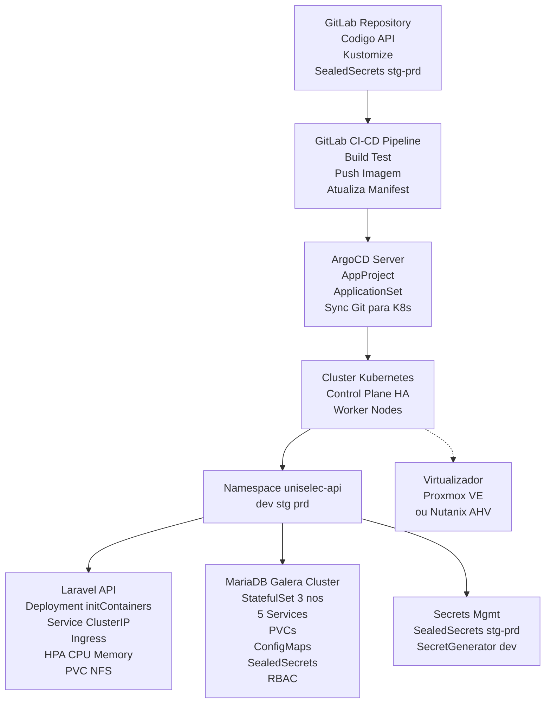

Repositórios no gitlab:

    API:

        git clone http://dti-gitlab.unilab.edu.br/dti/uniselecapi.git

    Página do Candidato:

        git clone http://dti-gitlab.unilab.edu.br/dti/uniselecwebsite.git

    Página do administrador:

        http://dti-gitlab.unilab.edu.br/dti/uniselecadminpage.git


Links:

    Ideal:

        Página do candidato:

            Produção:

                https://uniselec.unilab.edu.br

            Homologação:

                https://uniselec-staging.unilab.edu.br

        Página do Administrador:

            Produção:

                https://uniselec-bo.unilab.edu.br

            Homologação:

                https://uniselec-bo-staging.unilab.edu.br

        API:

            Produção:

                https://uniselec-api.unilab.edu.br

            Homologação:

                https://uniselec-api-staging.unilab.edu.br


O que eu consigo fazer em pouco tempo:

 php artisan l5-swagger:generate


    Página do Candidato:
        Produção:

            https://uniselec.jefponte.com

        Homologação:

            https://uniselec-staging.jefponte.com

        Produção (Link alternativo, serviço gratuito do Firebase):

            https://uniselec.web.app


    Página do administrador:

        Produção:
            https://uniselec-bo.jefponte.com

        Homologação:

            https://uniselec-bo-staging.jefponte.com

        Produção (Link alternativo, serviço gratuito do Firebase):


            https://uniselec-unilab-bo.web.app

    API:

            https://uniselec-api.jefponte.com

            https://uniselec-api-staging.jefponte.com


## Iniciar Ambiente de desenvolvimento:

        composer install

        docker compose up -d

        sudo chmod -R 777 storage

        sudo chmod -R 777 bootstrap/cache

        sudo chown -R 1001:1001 docker/redis

        sudo chmod -R 777 docker/redis


    Docker compose:

        docker compose up -d

    Executar migrations e seeds:

        docker exec -it uniselec-api bash -c "php artisan migrate"
        docker exec -it uniselec-api bash -c "php artisan db:seed"

        docker exec -it uniselec-api bash -c "php artisan db:seed --class=UserSeeder"


        docker exec -it uniselec-api bash -c "php artisan route:cache"

        docker exec -it uniselec-api bash -c "php artisan route:clear"


        docker exec -it uniselec-api bash -c "php artisan storage:link"

### Arquitetura da solução


## Segredos (Sealed Secrets)
```sh
kubectl apply -f https://github.com/bitnami-labs/sealed-secrets/releases/download/v0.33.1/controller.yaml
kubeseal -f regcred-secret.yaml -w base/sealed-secret-regcred.yaml --scope cluster-wide
kubeseal --validate < base/sealed-secret-regcred.yaml
```
### Desprovisionar Deploy
```sh
argocd login argocd.unilab.edu.br --username admin --password "pass" --grpc-web
kubectl get applicationset -A
kubectl -n argocd patch applicationset uniselec-api-dev-as --type='merge' -p '{"spec":{"generators":[{"list":{"elements":[]}}]}}'
argocd app list | grep uniselec-api-dev
```

### Re-Provisionar Deproy
```text
┌───────────────────────────────────────────────────────────────────────────┐
│                       Inital Pipeline Execution Flow                      │
└───────────────────────────────────────────────────────────────────────────┘
┌──────────────┐  ┌───────────┐  ┌──────────┐  ┌──────────┐  ┌──────────────┐
│   validate   │─>│   tests   │─>│  build   │─>│ staging  │─>│ notification │
└──────────────┘  └───────────┘  └──────────┘  └──────────┘  └──────────────┘
│                 │              │             │             │
├─ docker         ├─ dependency  └─ docker     └─ deploy     └─ staging
├─ environment    ├─ sast_scan                 (re-run aqui)
└─ kustomize      ├─ sonarqube
                  └─ unit
```
**Ação necessária**: Rodar o Job `staging` da Pipeline GitLab CI/CD GitOps

